# CupaGoovno Moai documentation
It's a simple documentation meant to be read and understood by regular players. It describes how does the boss work without getting into details of learning algorythms.

## Attacks
For balance reasons, attacks are divided into main and support. The boss uses attacks in pairs of 1 main and 1 support. Each attack has parameters changing its behaviour and a general parameter blancing them. E.g. if parameter X has multiplier (1, 2) and parameter Y has divider (1, 3) then general parameter of 0.8 will multiply X by 1.8 and divide Y by 2.6. 
- Main
    - Laser
        - Fires lasers from eyes. If the laser hits the left wall, it spawns sparks. The angle at which spark will fire is in the middle between laser and the wall. One eye aims at you and the other one fires randomly.
        - Delay: 1.
            - Multiplier: (0.7, 2).
        - Warning time: 0.7.
        - Laser duration: 0.3.
            - Multiplier: (0.5, 3).
    - Giant stone
        - Rolls from left to right, spawning 2 prryble birds helping you jump over it. You can also damage it to make it smaller.
        - Health: 300.
            - Divider: (0.666, 2).
        - Size multiplier: (0.8, 1.4).
    - Shitlings
        - Rain of little moais.
        - Count: 40.
            - Divider: (1, 3.333).
        - Delay: 0.2.
            - Multiplier: (1, 3.333).
        - Speed divider: (1, 1.111).
        - Scale multiplier: (1, 2).
    - Rockets
        - Rockets moving horizontally, in 3 rows.
        - Delay: 1.
            - Divider: (1, 2.5).
        - Speed multiplier: (0.5, 1.5).
    - Pusher
        - A giant enemy moving towards you from the left. You need to parry it a few times to push it back. Increases its acceleration after each parry. Damage can slow him down or push him back. After 10 seconds becomes red and becomes immune to damage.
        - Pushes: 7.
        - Starting acceleration: 500.
            - Multiplier: (0.3, 2).
        - Acceleration increase after parry: 500.
            - Divider: (0.666, 1.666).
- Support
    - Pollen
        - Spawns slowly falling projectiles in some x axis range.
        - X range span: 350 (screen width is 720).
            - Bonus: (0, 500).
    - Spikes
        - Spawns 3 spikes from the ground. Damage makes them hide a bit or completely disappear.
        - Health: 80.
        - Middle spike x: -200.
            - Other spikes distance from middle spike: (120, 350).
    - Crackhead
        - Runs aroung the screen. Damage will make him leave sooner.
        - Health: 75.
            - Divider: (0.833, 2).
        - Speed multiplier: (0.3, 1.5).
    - Bouncers
        - Spawns bouncing and moving horizontally enemies. Damage makes them smaller or disappear.
        - Health: 15.
            - Divider: (0.5, 1.333).
        - Count: 5.
        - Gravity multiplier: (0.5, 2).
    - Baseball
        - Enemy swinging basebll bat on top of the screen. Damage makes him hide a bit or completely disappear.
        - Health: 50.
            - Divider: (0.5, 2).
        - Speed multiplier: (0.5, 2).

## Heart
Every 2-4 attacks the boss will spawn a heart. Parry it to heal.

## Hitboxes
The green lines are hitboxes. Most of them are circles and rectangles but the are a few polygon ones.
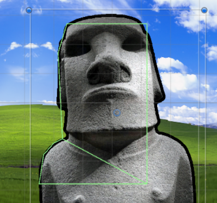
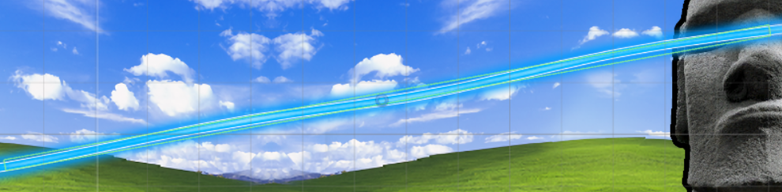
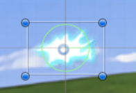
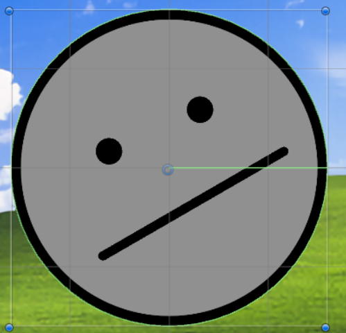
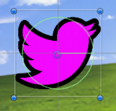
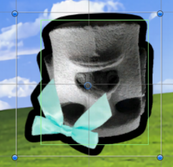
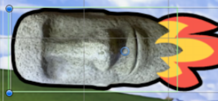
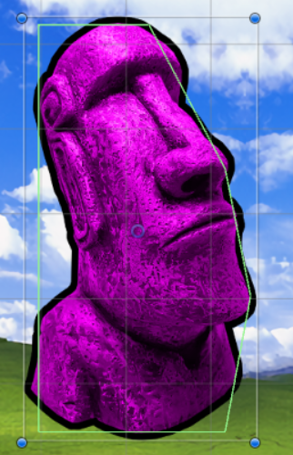
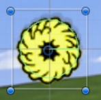
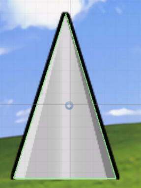
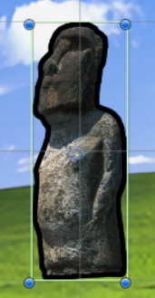
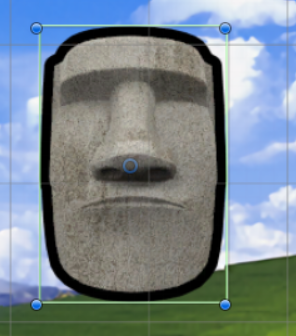
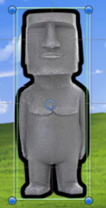
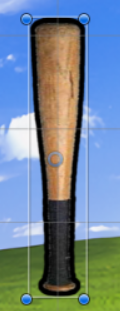
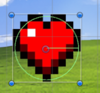

## Choosing attacks
Moai uses Q-Learning algorythm and Softmax function to create and update a table containing chances to use each attack. Example table update after failed rockets + baseball attack:
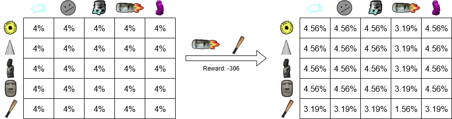

Reward is based on how much damage did the boss take, did it spawn a heart, did player heal and did they receive damage.

Reward = 2000 * △PlayerHP - △MoaiHP.
△ - Difference in value after an attack.
If the heart has spawned, additional 1000 is added to the reward.

Then the reward is scaled so it's never too big: scaledReward = 650 * tanh(reward / 650).
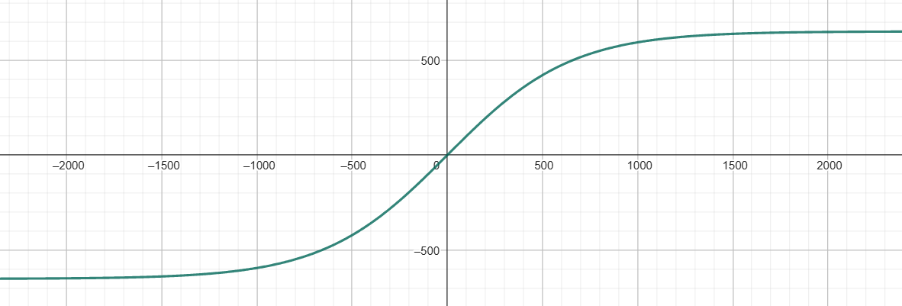

Q-Learning creates a table of expected rewards for each attack which is used by Softmax function to create the chances table.

## Choosing parameters
Moai uses REINFORCE algorythm to sample general parameter from beta distribution. The disctribution is updated based on value of the sample and the reward. Example of update after a successful attack with general parameter 0.1:

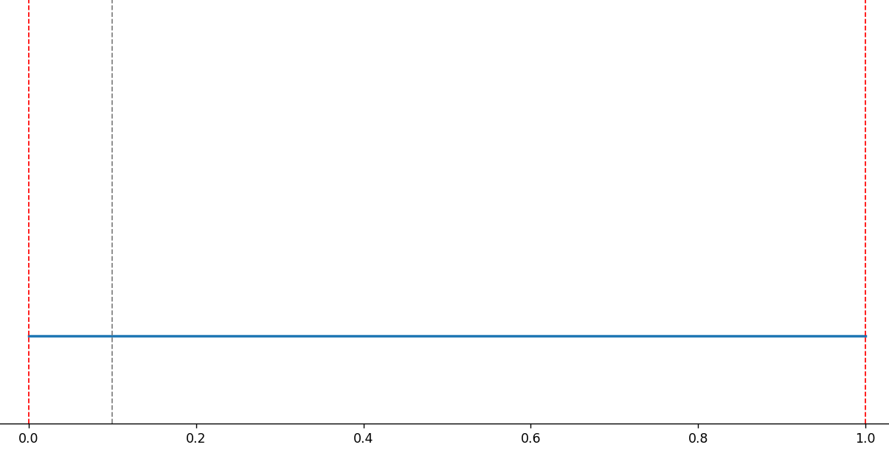

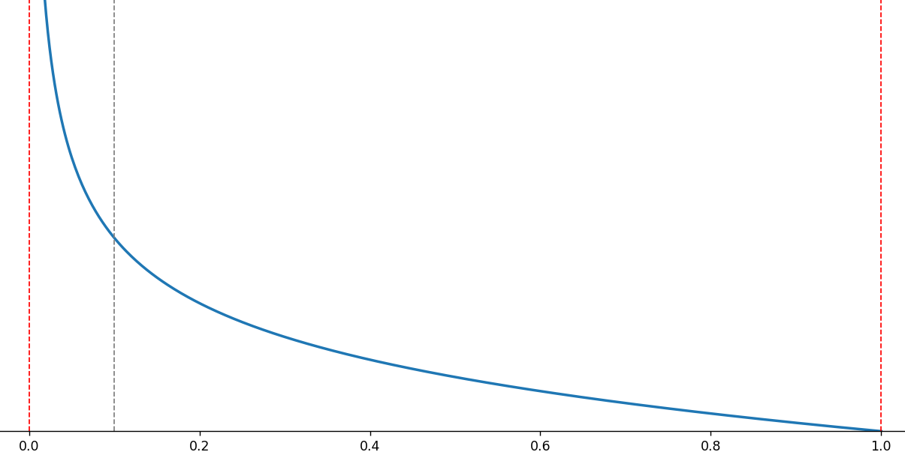

In very simple words - If 0.1 turns out successful, it will increse the chance of choosing low values.

You can view MoaiLearningLog.csv in the main game folder to see how it worked for you.

## That's it
No neural networks, no teaching the boss for days. It also learns everything during a single battle and forgets it all afterwards. If it didn't then you'd be able to cheese it by purposefuly getting hit by easy attacks in one battle and then have it easier for some time in the second battle. The downside is that it has a really short time to learn and isn't perfect.

## Why only 1 phase?
Each phase would have a different set of attacks so it would need a seperate learning process. Having 2 phases would make the fight twice as long. And you'd have to wait till 2026 for me to make it.